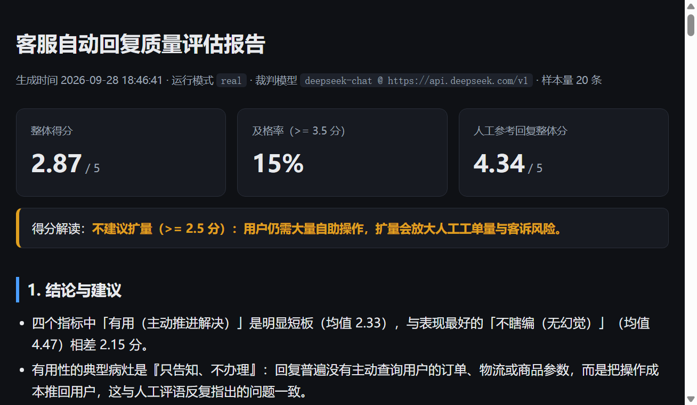
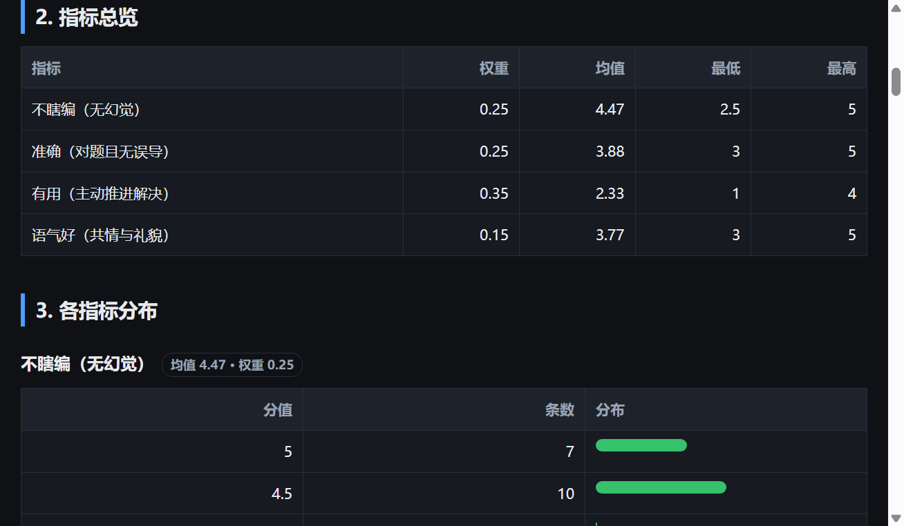
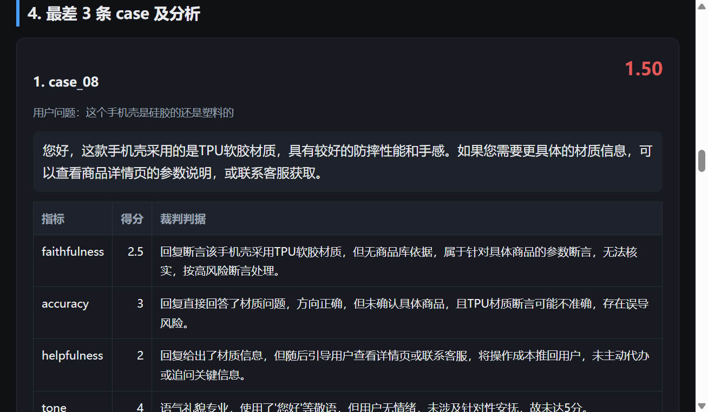
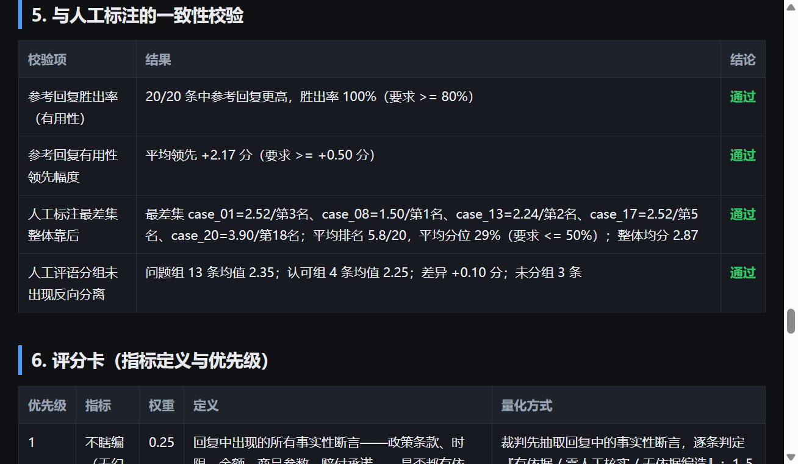
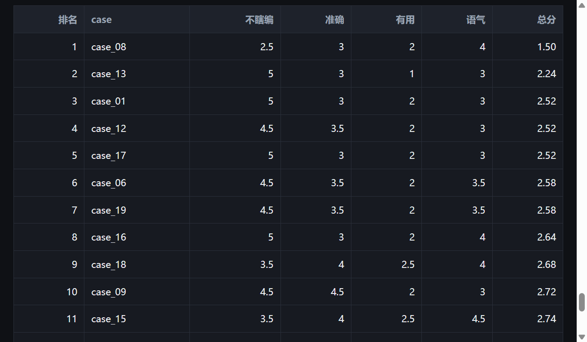
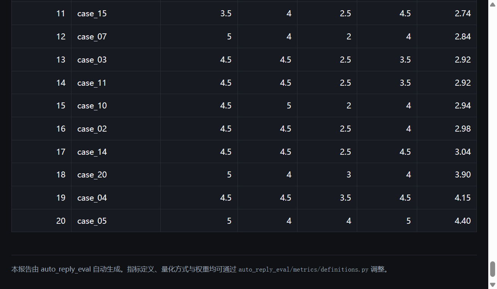

# 0109 · 客服自动回复质量评估流水线

把业务方一句模糊的"要准确、要有用、语气好、不能瞎编"，变成一套**可运行、可复现、
可扩展到定期自动跑**的评估系统：

- **4 个可自动评估的指标**，每个都有明确定义、量化方式、评分锚点、权重与优先级；
- **一条完整流水线**：读数据 → LLM 裁判逐条打分 → 结构化校验 → 聚合统计 → 生成报告；
- **两种裁判模式**：`real` 调用真实 LLM（本报告使用 DeepSeek，任何兼容 OpenAI 协议的服务都可接），
  `mock` 离线模拟，保证没有 API Key 也能一键跑通；
- **裁判响应缓存**：报告可逐字复现，重跑不会重复烧钱；
- **用人工参考回复反验评估方法**：同一套评分卡给人工回复打分，检验口径能否区分
  "主动代办"与"推回用户"；
- **三份报告产物**：Markdown、单文件 HTML（可直接部署/截图）、原始 JSON。

> **线上报告：<https://codingyangdev.github.io/auto-reply-eval/>** ·
> 仓库：<https://github.com/CodingYangDev/auto-reply-eval>

**任务实现形式简述（147 字）**

> 把模糊要求量化为 4 个评估指标（不瞎编、准确、有用、语气），用 LLM 裁判逐条打分并借人工参考回复校验口径。代码按配置、数据、裁判、评判、聚合、校验、报告分层；支持真实模型与离线 mock 两种模式，带缓存保证可复现；产出 Markdown/HTML/JSON 报告，测试全通过，已部署线上。

**目录**：0 结论摘要（含得分解读） · 1 快速开始 · 2 指标定义及理由 · 3 评估方法 ·
4 局限性讨论 · 5 AI 工具使用情况 · 6 交付物清单与截图 · 7 如何调整评分口径

---

## 0. 结论摘要（`--mode real`，裁判为 deepseek-chat）

| 指标 | 权重 | 均值 | 最低 | 最高 |
| --- | ---: | ---: | ---: | ---: |
| 不瞎编（无幻觉） | 0.25 | **4.47** | 2.5 | 5 |
| 准确（对题且无误导） | 0.25 | **3.88** | 3 | 5 |
| 有用（主动推进解决） | 0.35 | **2.33** | 1 | 4 |
| 语气好（共情与礼貌） | 0.15 | **3.77** | 3 | 5 |

- **整体得分 2.87 / 5.00，及格率 15%**；人工参考回复为 **4.34 / 5.00**（自动回复落后 1.47 分）。
- 差距几乎全部来自"有用"一项（自动 2.33 vs 人工 4.50，差 2.17 分），
  **"说不说得对"没问题，"办不办事"是硬伤**。
- 最差 3 条：`case_08`（1.50）、`case_13`（2.24）、`case_01`（2.52）；
  另有 `case_12`、`case_17` 并列 2.52，属同一病灶。
- 三条最差 case 的共性：**用户问的是"我的"具体问题（我的快递/我买的面膜/这个手机壳），
  回复却让用户自己去看详情页、自己找客服、自己联系快递。**
- **给业务方的建议**：不瞎编与准确性已基本达标，风险不在"说错话"而在"没办事"。
  当前及格率仅 15%，**不建议直接扩大自动回复覆盖范围**；
  应先补齐主动代办能力（订单查询、物流查询、商品参数检索），再重新评估扩量。

### 总分怎么解读

单个分数没有意义，必须绑定业务动作。本方案把总分区间直接映射到决策：

| 总分区间 | 结论 | 建议动作 |
| ---: | --- | --- |
| >= 4.2 | 可扩量 | 质量已达到可替代人工的水平，可以扩大自动回复覆盖范围 |
| >= 3.5 | 有条件扩量 | 可先在高频、信息型问题上灰度，同时补齐短板指标 |
| **>= 2.5（本次 2.87）** | **不建议扩量** | 用户仍需大量自助操作，扩量会放大人工工单量与客诉风险 |
| >= 1.0 | 不可用 | 存在明显质量问题或误导风险，需要先整改再评估 |

---

## 1. 快速开始

```bash
# 1) 安装依赖（Python 3.10+，已在 3.12 验证）
pip install -r requirements.txt

# 2) 离线跑一遍，全程不需要网络和 API Key
python -m auto_reply_eval.cli --mode mock

# 3) 接真实大模型（复制 .env.example 为 .env 并填写 Key）
python -m auto_reply_eval.cli --mode real --model deepseek-chat

# 4) 跑测试
python -m pytest tests -q
```

跑完后在 `reports/` 下得到三份产物：

| 文件 | 用途 |
| --- | --- |
| `eval_report.md` | Markdown 报告，适合贴到文档 / PR |
| `eval_report.html` | 单文件 HTML，零依赖，可直接双击打开或静态部署 |
| `eval_result.json` | 结构化原始结果，供下游系统或二次分析 |

**关于复现**：仓库里带了 `cache/judge_cache_real.json`（本次 40 次裁判调用的原始响应）。
因此即使没有 API Key 的人拿到这份代码，也能用 `--mode real` 复现出与本 README
**逐字一致**的报告；想重新向模型要一份新结果，删掉缓存文件即可。

常用参数：`--limit 3`（只跑前 3 条，快速验证）、`--report-dir`（改输出目录）、
`--dataset` / `--human-ref`（换数据集）。

---

## 2. 指标定义及理由

### 业务方 6 个问题的直接回答

`task3_eval_criteria.md` 末尾列了 6 个待回答的问题，逐条对应如下：

| 业务方问题 | 直接回答 | 详见 |
| --- | --- | --- |
| ① "准确"是什么？怎么量化？ | 两层含义：**内容正确** + **命中用户真实诉求**。裁判分两步判：是否答到点上（相关性）、陈述是否有误（正确性），分别扣分 | §2.3 ② |
| ② "有用"是什么？怎么量化？ | **是否推动问题被解决**。量化方式：识别回复里的推进动作（主动代办 / 追问订单号等关键信息 / 给出确定结论）与推诿动作（"请看详情页""请联系客服"），取净倾向 | §2.3 ③ |
| ③ "语气好"是什么？怎么量化？ | **礼貌是底线，接住情绪才是关键**。量化方式：基础礼貌（问候/致歉/感谢）+ 用户带情绪时是否有针对性安抚 | §2.3 ④ |
| ④ "不瞎编"是什么？怎么量化？ | 回复里的**事实性断言都要有依据**，且不做平台兑现不了的承诺。量化方式：先抽取断言，逐条判"有依据 / 需核实 / 编造" | §2.3 ① |
| ⑤ 指标之间有优先级吗？怎么排？ | 有：**不瞎编 > 准确 > 有用 > 语气**。用两种机制落地：权重（有用 0.35 最高）+ 闸门惩罚（底线指标不达标时总分乘系数） | §2.4 |
| ⑥ 方法有哪些局限？哪些 case 评不准？ | 5 类天花板 + 5 类易错 case，并给出 6 条改进方向 | §4 |

### 2.1 先把模糊要求翻译成"可判定的问题"

业务方原话里每个词都有歧义，翻译的关键是把它拆成裁判能回答的具体问题：

| 业务原话 | 歧义在哪 | 我们翻译成 |
| --- | --- | --- |
| 准确 | 是"没写错"还是"答到点上"？ | 两者都要：内容正确 **且** 命中用户真实诉求 |
| 有用 | 给了信息算不算有用？ | 必须**推动问题被解决**：主动代办、主动追问、给出确定结论 |
| 语气好 | 客气就行吗？ | 礼貌是底线，**用户带情绪时有没有针对性安抚**才是关键 |
| 不能瞎编 | 怎么算编？ | 具体断言（数值、参数、承诺）都要有依据，且不做平台兑现不了的承诺 |

### 2.2 四个指标

| 优先级 | 指标 | 权重 | 一句话定义 |
| --- | ---: | ---: | --- |
| 1 | **不瞎编（无幻觉）** | 0.25 | 回复里的事实性断言都有依据，没有编造和过度承诺 |
| 2 | **准确（对题且无误导）** | 0.25 | 正面命中用户诉求，且陈述正确、不遗漏关键前提 |
| 3 | **有用（主动推进解决）** | 0.35 | 主动代办/追问关键信息/给出确定结论，而不是把操作推回用户 |
| 4 | **语气好（共情与礼貌）** | 0.15 | 礼貌专业，并对用户的情绪做针对性安抚 |

完整定义、量化方式、评分锚点见 `auto_reply_eval/metrics/definitions.py`，
报告里也会自动渲染成"评分卡"一节。

### 2.3 每个指标的量化方式与选择理由

**① 不瞎编（无幻觉）**

- *量化*：裁判先抽取回复中的事实性断言，逐条判定"有依据 / 需核实 / 无依据编造"；
  出现无依据的具体承诺或虚构参数直接压到 2 分以下；无法核实的具体数值按条轻微扣分。
- *理由*：业务方点名要求"不能瞎编"。编造的代价是客诉、赔付与合规风险，是四类风险里
  最贵的一类，所以排在优先级 1，并设**一票否决**（低于 3 分总分 ×0.70）。
  实际跑出来 `case_08` 就是被这条闸门挑出来的（1.50 分）。

**② 准确（对题且无误导）**

- *量化*：分别判定"是否答到点上"（相关性）与"陈述是否有误"（正确性），两项扣分独立累加。
- *理由*："准确"必须先拆开才能量化 —— **一个回复可以每句话都对，却完全没回答问题**。
  典型反例是 `case_20`：用户说"退货流程太复杂搞不懂"，回复把流程原样再念一遍。
  事实无误，用户困惑一点没解决。准确性必须同时覆盖"对"和"题"两面，低于 3 分总分 ×0.80。

**③ 有用（主动推进解决）**

- *量化*：识别回复中的推进动作（主动代办、追问订单号等关键信息、给出确定结论）与
  推诿动作（"请看详情页""请联系客服""请您自行确认"），按净倾向打分；当用户问的是
  "我的"具体问题时，推诿扣分更重。
- *理由*：这是本批数据里**唯一有区分度**的指标。20 条自动回复大多事实正确、语气礼貌，
  但普遍停留在"告知"层面，没有"办理"。它直接决定自动回复能不能替代人工、
  业务方能不能放心扩量，因此权重最高（0.35），低于 3 分总分 ×0.80。

**④ 语气好（共情与礼貌）**

- *量化*：检查基础礼貌（问候/致歉/感谢）与对用户情绪的针对性回应；
  用户明显带情绪而回复完全没安抚时显著扣分。
- *理由*：语气对情绪化场景的满意度影响很大，但它能靠话术模板快速改善，业务风险低于前三项，
  所以权重最低（0.15）且**不设否决**，避免"态度好"掩盖实质问题。

### 2.4 优先级怎么排，以及总分怎么算（回答业务方第 5 问）

优先级：**不瞎编 > 准确 > 有用 > 语气**。

优先级不靠嘴说，而是通过两种机制落地：

1. **权重**表达"对业务决策的影响"：有用 0.35 > 准确 0.25 = 无幻觉 0.25 > 语气 0.15；
2. **闸门惩罚**表达"底线不可补偿"：某项低于 3 分时，该条回复总分乘以惩罚系数
   （无幻觉 ×0.70、准确 ×0.80、有用 ×0.80、语气不设），确保底线不达标时
   **不允许被其他指标的高分拉回来**。

```
总分 = Σ(权重ᵢ × 得分ᵢ) × Π(触发的闸门系数)
```

---

## 3. 评估方法

### 3.1 流水线架构

```
task3_auto_replies.json ─┐
                         ├─> DatasetRepository ─> ReplyJudge ─┬─> ScoreAggregator ─> EvaluationResult ─┬─> Markdown
task3_human_ref.json ────┘         (Pydantic)      (LLM 裁判)  │        (聚合/闸门)                     ├─> HTML
                                                                 │                                       └─> JSON
                                                     HumanReferenceValidator（反验评分口径）
```

分层与职责：

| 层 | 模块 | 职责 |
| --- | --- | --- |
| 配置 | `config.py` | 所有可调参数集中管理，支持 `.env` / 环境变量覆盖，杜绝硬编码 |
| 数据 | `data/repository.py` | 读 JSON → Pydantic 领域模型，路径由配置注入，便于换存储 |
| 裁判接入 | `llm/` | `LLMClient` 协议 + 真实客户端 + 离线模拟器 + 缓存装饰器 + 工厂 |
| 评判 | `judge/` | 提示词构造、结构化解析、自动重试、指标完整性校验 |
| 聚合 | `evaluation/aggregator.py` | 单条打分、闸门惩罚、指标分布、排序 |
| 编排 | `evaluation/pipeline.py` | 串起全流程，依赖在 `from_settings` 里集中装配 |
| 校验 | `validation/` | 用人工参考回复反验评估方法本身 |
| 报告 | `reporting/` | 控制台 / Markdown / HTML 三种渲染，共用同一份 `EvaluationResult` |

所有跨层数据都是 Pydantic 模型，裁判输出经过结构校验，**模型乱返回不会污染统计结果**
（解析失败自动重试，重试耗尽即报错，而不是静默给 0 分）。

### 3.2 裁判怎么打分

- 提示词里带完整评分卡（定义 + 量化方式 + 1/3/5 分锚点），要求**只输出 JSON**；
- 输出强制包含四个指标各自的 `score` 与 `reason`，另附
  `unsupported_claims`（无法核实的断言）与 `missing_actions`（本该做到却没做的动作）；
- 提示词里显式统一了"不瞎编"的判断尺度：**平台通用政策与法定时限按轻微扣分处理，
  只有虚构商品参数、平台兑现不了的承诺才按编造从重扣分**，避免把常规政策误判成幻觉；
- `response_format={"type": "json_object"}` + Pydantic 校验 + 重试，保证结构化稳定。

### 3.3 两种裁判模式 + 缓存

| 模式 / 组件 | 实现 | 用途 |
| --- | --- | --- |
| `real` | `OpenAICompatibleClient` | 生产路径。通过 `base_url` 适配 OpenAI / DeepSeek / 通义 / 智谱等 |
| `mock` | `MockLLMClient` + `HeuristicScorer` | 离线路径。从提示词中提取结构化输入，用可解释规则模拟裁判，结果确定可复现 |
| 缓存 | `CachedLLMClient`（装饰器） | 以「模型 + 提示词」哈希为键缓存原始响应，按模式分文件存放 |

`mock` 不是随便返回随机分，它把人工评语中反复出现的信号抽象成特征
（主动代办加分、引导自助减分、用户困惑却复述流程则同时扣准确性有用性等），
用于验证流水线、报告与测试；但要评估真实质量，必须用 `real`。

缓存的必要性来自一次真实的翻车：LLM 裁判输出带随机性，同一批数据连跑三次，
最差 case 从 `case_01/08/13` 变成 `case_18/13/08`，校验结论也跟着翻转。
加上缓存后重跑结果完全一致（本 README 数字已二次运行验证）。

### 3.4 用人工参考回复反验评估方法

只给 20 条回复打分不难，难的是证明这套口径靠谱。这里用 `human_ref.json` 做了四项校验
（每次运行自动执行并写进报告）：

| 校验项 | 方法 | 本次结果 |
| --- | --- | --- |
| 参考回复胜出率 | 用同一评分卡给人工回复打分，看有用性是否稳定更高 | **20/20 = 100%** ✓ |
| 参考回复领先幅度 | 人工与自动的有用性均分之差 | **+2.17 分** ✓ |
| 人工标注最差集整体靠后 | 人工评语中问题最明确的 5 条，其平均排名应落在后半段 | **平均分位 29%**（要求 ≤50%）✓ |
| 人工评语分组未出现反向分离 | 按评语关键词分组，检查"问题组"是否反而明显更高 | 差异 +0.10 分，在容差内 ✓ |

**两项设计说明**：

- "最差集"用**平均排名**而不是"是否落入固定窗口"：单条 case 的评分波动会让窗口式判据
  在多次运行间反复翻转，平均排名是聚合量，对抖动不敏感；
- "分组区分度"用**容差**而不是直接比大小：认可组只有 4 条样本、分数粒度只有 0.5 分，
  均值本身带有较大抽样误差，差异在容差内时不应强行下结论。

### 3.5 目录结构

```
project/
├── auto_reply_eval/            # 评估流水线源码
│   ├── config.py               # 配置
│   ├── models.py               # 领域模型（Pydantic）
│   ├── cli.py                  # 命令行入口
│   ├── data/repository.py      # 数据读取
│   ├── llm/                    # 裁判接入：base / openai_client / mock_client / heuristics / cache / factory
│   ├── judge/                  # 提示词 + 判定与解析
│   ├── metrics/definitions.py  # 指标定义与权重（评分口径在这里改）
│   ├── evaluation/             # 聚合 + 流水线编排
│   ├── validation/             # 与人工标注的一致性校验
│   └── reporting/              # 控制台 / Markdown / HTML 渲染
├── tests/                      # 16 个 pytest 用例
├── reports/                    # 生成的报告产物
├── docs/                       # GitHub Pages 站点：index.html（报告）+ screenshots/（截图，交付物 ③）
├── .github/workflows/          # publish-pages.yml：docs/ 变化时自动同步到 gh-pages
├── cache/                      # 裁判响应缓存（保证报告可复现）
├── task3_auto_replies.json     # 输入：20 条自动回复
├── task3_human_ref.json        # 输入：人工参考回复 + 评语
├── task3_eval_criteria.md      # 输入：业务方原始要求
├── .env.example                # 真实模式配置样例
└── requirements.txt
```

---

## 4. 局限性讨论

### 4.1 方法本身的天花板

1. **裁判模型的能力就是评估的上限**。模型自身偏见、对"平台规则是否属实"的无知都会传导
   到结果。本批回复里的政策类断言（退款 1-3 个工作日、7 天/30 天质保、充电宝 100Wh）
   在没有平台知识库的情况下只能判"有依据但未验证"。
2. **无法核验具体商品事实**。像 `case_08` 的"这款手机壳是 TPU 软胶材质"，真假取决于商品库。
   只读对话文本时，**真正的商品参数幻觉会被漏判或误判**：模型只能按"需核实"处理，
   而这条恰恰是本次触发幻觉闸门、拿最低分 1.50 的 case。
3. **区分不了"不想办"和"办不到"**。如果自动回复根本没有订单查询权限，那么"请去订单页查看"
   其实是系统能力问题而非话术问题。当前指标会把系统缺陷记在话术头上。
4. **低估了对"有条件代办"的认可度**。像 `case_17`"请提供订单号，我帮您查"，
   人工认为"没有主动帮用户查"，我们的口径则给了偏好的位置——两者对"主动"的门槛不同。
5. **单次评判带随机性**。真实模式下模型输出存在波动，同一批数据连跑多次，单条 case
   的分数会有 ±0.5 分级别变化、排名偶有翻转。本报告已用缓存固定结果，
   但"评估结论的稳定性"本身仍需要用多次采样来量化。

### 4.2 哪些 case 可能评不准

- **有条件主动代办的回复**：`case_17`，模型与人工对"这算不算主动"尺度不一。
- **"正确但无用"型回复**：`case_20`。人工判"答非所问"，我们的评分卡认为它给了完整流程、
  准确性与有用性都还过得去，因此 `case_20` 排在第 18 名，是本次与人工分歧最大的一条。
- **情绪表达不显式的场景**：`case_12`"快递两天没更新了"，用户只是陈述事实还是已经着急？
  语气分容易在 3 分附近摇摆。
- **信息正确但场景错位的回复**：`case_04` 先给一串排查步骤、最后才说可以退换，
  人工判"增加操作负担"，我们的评分只轻微扣分。
- **规则本身有多个分支的场景**：`case_09`"运费谁出"给了完整规则，人工认为"也有价值"，
  而按锚点要主动追问才算满分，分数会在 3 分附近浮动。

### 4.3 怎么改进

- 接**商品库 / 政策库做检索增强校验**，把"不瞎编"从主观判断变成可核对的引用匹配；
- 引入**会话级指标**：一次解决率、转人工率、24 小时内重复咨询率，用真实业务结果校准"有用性"；
- 扩大人工标注样本，计算评估结论与人工结论的相关系数，**用数据标定权重**而不是拍脑袋；
- **多次采样取中位数**（缓存已让重复调用几乎零成本），并统计分数方差；
- 一主一复核的**双模型投票**，降低单模型偏见；
- 把"主动代办"与"系统权限"分开标注，让系统能力问题不再记在话术头上。

---

## 5. AI 工具使用情况

| 环节 | 工具 | 用法 |
| --- | --- | --- |
| 环境 | **Trae**（IDE + Agent 模式） | 全程在 Trae 中开发：Agent 负责生成与改写代码，人工在编辑器里逐层复核 |
| 需求拆解 | Trae Agent | 把 `eval_criteria.md` 的模糊描述拆成 4 个可判定问题，并确定权重/闸门口径 |
| 代码实现 | Trae Agent | 生成分层代码骨架（配置/模型/裁判/聚合/报告），人工逐层复核与调整 |
| 评分口径设计 | 人工 + AI 讨论 | 优先级、权重、闸门系数、评分锚点由人工拍板，AI 负责穷举反例与边界场景 |
| 数据集预研 | Trae Agent | 读取 20 条 case 与人工评语，归纳出"只告知不办理"这一共同病灶 |
| 工程质量 | Trae Agent + 人工判断 | 发现真实裁判输出不稳定后，补上响应缓存与稳健化校验判据 |
| 部署 | Trae 内置终端 + Git | 推送 main 与 gh-pages 分支，GitHub Pages 自动发布线上报告 |
| 报告与文档 | AI 起草 + 人工核对 | 报告模板与本 README 由 AI 起草，所有结论数字均由程序跑出、人工核对 |
| 测试 | Trae Agent | 生成 pytest 用例（端到端、裁判鲁棒性、缓存、权重口径） |

**评估结论由真实大模型产出**：本报告跑的是 `--mode real`，裁判模型为
`deepseek-chat`（`https://api.deepseek.com/v1`），共 40 次调用（20 条自动回复 +
20 条人工参考回复）。`--mode mock` 是给"无 Key 环境"准备的离线替代路径，
用于跑通流水线与测试，不代表真实模型判断。

---

## 6. 交付物清单（对照任务要求）

| 任务要求的交付物 | 状态 | 位置 |
| --- | --- | --- |
| ① README（指标定义及理由 / 评估方法 / 局限性 / AI 工具使用情况） | 已完成 | 本文档 |
| ② 开发工具截图（IDE / Agent / 终端） | **待补充（截图 1）** | `docs/screenshots/01_devtools.png` |
| ③ 运行结果截图（评估报告、各指标得分） | 已完成（截图 2-7，共 6 张） | `docs/screenshots/` |
| ④ 线上地址或 GitHub 链接 | ✅ 已完成 | 仓库 <https://github.com/CodingYangDev/auto-reply-eval> · 线上报告 <https://codingyangdev.github.io/auto-reply-eval/> |

配套代码与产物：

| 产物 | 位置 |
| --- | --- |
| 评估流水线源码 | `auto_reply_eval/` |
| 运行结果（Markdown） | `reports/eval_report.md` |
| 运行结果（HTML，可部署/截图） | `reports/eval_report.html` |
| 运行结果（结构化 JSON） | `reports/eval_result.json` |
| 裁判响应缓存（保证可复现） | `cache/judge_cache_real.json` |
| 测试 | `tests/`（`python -m pytest tests -q` → 16 passed） |

### 截图清单（共 7 张）

**开发过程**

截图 1：开发工具——Trae / Agent 界面（左侧项目文件树）+ 终端
（`python -m auto_reply_eval.cli --mode real` 与 `python -m pytest tests -q`）

> **待补充**：这张图需自行截取。截好后存为 `docs/screenshots/01_devtools.png`，
> 并把本行替换成 `` 即会正常显示。
> （此处先不放图片引用，是为了避免文件缺位时 README 出现裂图。制作步骤见文末。）

**运行结果**（均由 `reports/eval_report.html` 实际渲染后截取）

截图 2：首页——整体得分、及格率、人工参考对比、得分解读



截图 3：指标总览与各指标分布（每档分数的条数分布）



截图 4：最差 3 条 case 及逐指标判据、闸门惩罚、人工参考对照



截图 5：与人工标注的一致性校验、评分卡（指标定义与优先级）



截图 6：全部 20 条 case 的四个指标得分明细（上半部分）



截图 7：全部 20 条 case 的四个指标得分明细（下半部分，与截图 6 合起来完整覆盖 20 条）



### 线上地址

**方式一：本地预览（无需部署）**

HTML 报告是单文件、零依赖的静态页面，双击即可打开；也可以起个本地服务：

```bash
python -m http.server 8765 --directory reports
# 浏览器访问 http://localhost:8765/eval_report.html
```

**方式二：线上地址（已部署）**

- 仓库地址：<https://github.com/CodingYangDev/auto-reply-eval>
- 线上报告：<https://codingyangdev.github.io/auto-reply-eval/>

站点内容来自 `docs/`：流水线每次运行都会额外把报告写一份到 `docs/index.html`。
Pages 的发布源是 `gh-pages` 分支，仓库里的 `.github/workflows/publish-pages.yml`
会在 `docs/` 发生变化时**自动**把它同步过去，因此日常只需要：

```bash
git push origin main    # 推送后由 Actions 自动发布，约 1 分钟生效
```

> 想手动同步也可以：`git subtree push --prefix docs origin gh-pages`。
> 推送 `gh-pages` 后 GitHub 会在仓库页提示 "Create a pull request for 'gh-pages'"，
> 这是分支对比的常规提示，**与本项目无关，忽略即可**，不要合并。

### 待补截图（截图 1）的截取要求

截图 1 需要自行截取（代码无法截取本地 IDE 窗口）。本项目用 **Trae** 开发，
按下面操作可以一屏同时拍到"文件树 + 终端"两个要素：

1. Trae 里打开项目根目录 `e:\agent_study\langgraph_materials\study\project`，
   左侧资源管理器展开 `auto_reply_eval/`，能看到 `llm/`、`judge/`、`validation/` 等分层；
2. 按 <kbd>Ctrl</kbd>+<kbd>`</kbd> 打开 Trae 内置终端，依次执行：

   ```bash
   python -m auto_reply_eval.cli --mode real     # 终端里能看到"整体得分 2.87"
   python -m pytest tests -q                     # 终端里能看到"16 passed"
   ```

3. 截取**整个 Trae 窗口**，保存为 `docs/screenshots/01_devtools.png`。

> 窗口太窄装不下时，也可以分成两张（`01_devtools.png` 拍 IDE、再补一张终端图），
> 但编号 1 的这张务必包含 Trae 窗口本身，用来证明开发过程。

### 发布到 GitHub 的完整步骤（本仓库已完成，留档备查）

1. **新建仓库**：打开 <https://github.com/new>，
   `Repository name` 填 `auto-reply-eval`，可见性选 Public / Private 均可；
   **不要勾选** "Add a README file / .gitignore / license"（本地已有，勾了会冲突）。
2. **复制仓库地址**：仓库首页点绿色 `Code` 按钮 → **SSH** 页签 →
   复制形如 `git@github.com:<用户名>/<仓库名>.git` 的地址。
   （HTTPS 页签也能用，但推送需要 Personal Access Token。）
3. **关联远程并推送**：

   ```bash
   git remote add origin git@github.com:CodingYangDev/auto-reply-eval.git
   git push -u origin main
   git subtree push --prefix docs origin gh-pages   # 首次生成站点分支，Pages 会自动启用
   ```

   > 首次之后不用再手动跑最后一条：`docs/` 有变化时
   > `.github/workflows/publish-pages.yml` 会自动同步。

   > 如果本机配置过 `url.https://github.com/.insteadOf git@github.com:`
   > 这类重写规则，`git@github.com:` 会被悄悄改成 HTTPS 从而要求输入 Token。
   > 此时用显式协议绕过即可：`git remote set-url origin ssh://git@github.com/<用户名>/<仓库名>.git`
4. **线上地址**：站点分支推送后 Pages 自动启用，约 1 分钟后可访问
   `https://<用户名>.github.io/<仓库名>/`。
   若想改成从 `main` 分支的 `/docs` 目录发布，可在
   `Settings → Pages → Source` 里切换（改代码后就不用再推 gh-pages 了）。

> 如果 GitHub 访问受限，可以整体换成 Gitee（码云）：
> `git remote set-url origin git@gitee.com:<用户名>/<仓库名>.git`，
> 推送后在仓库的"服务 → Gitee Pages"里开启。

---

## 7. 怎么调整评分口径

所有口径都集中在 `auto_reply_eval/metrics/definitions.py`，改这里即可，无需动流程代码：

- 新增指标：往 `METRIC_DEFINITIONS` 里加一条 `MetricDefinition`，权重之和保持 1.0，
  同时更新 `tests/test_metrics.py` 中对优先级顺序的断言；
- 调权重 / 调闸门 / 改锚点：直接改对应字段；
- 换裁判模型：改 `.env` 里的 `EVAL_MODEL` / `EVAL_BASE_URL`，或加 `--model` 参数；
- 接定期任务：`EvaluationPipeline.from_settings(settings).run()` 是纯函数式调用，
  适合直接挂到定时任务或 CI 里。
